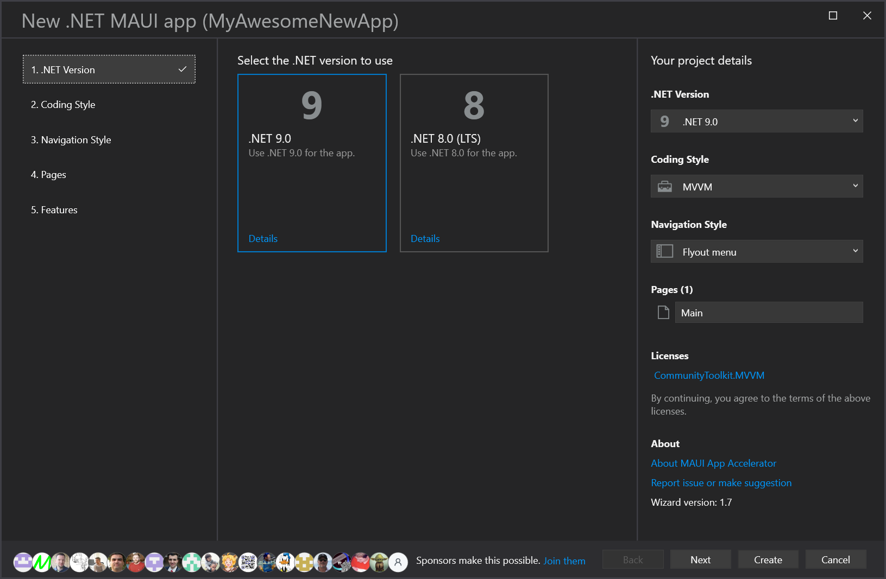
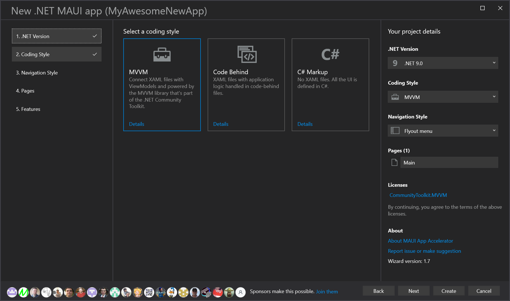
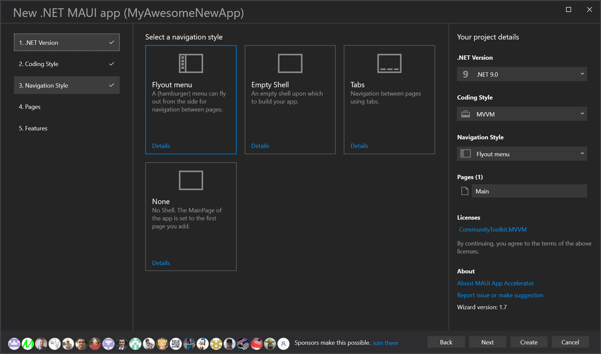
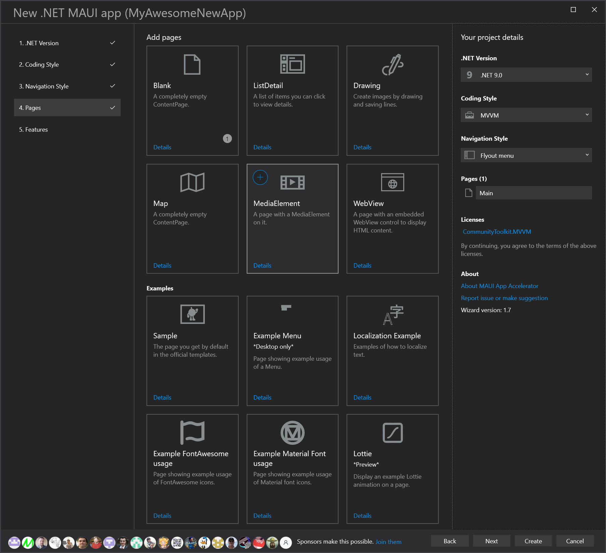
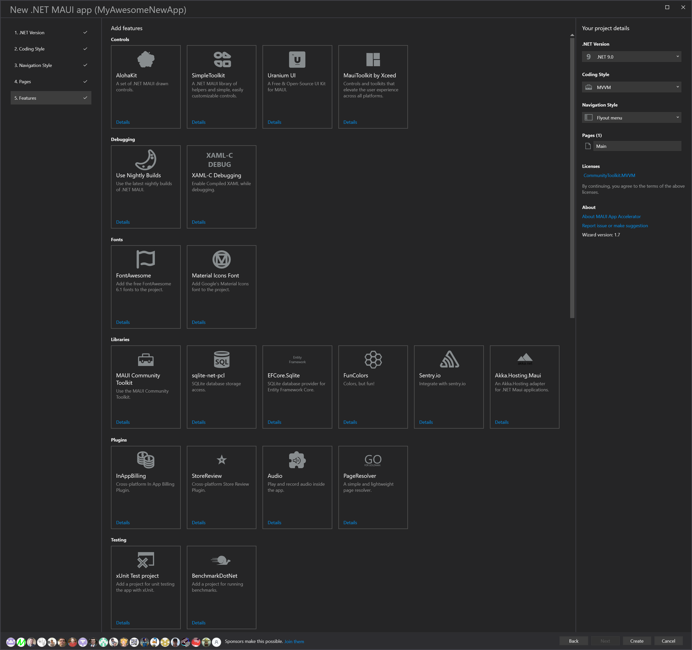

# MAUI App Accelerator

[A Visual Studio extension](https://marketplace.visualstudio.com/items?itemName=MattLaceyLtd.MauiAppAccelerator) to accelerate the creation of new .NET MAUI apps using a wizard-based UI.

> **Note**
> Currently in preview. More functionality is coming. Feedback wanted.

## 'File > New Project' made better

Jumpstart your .NET MAUI application development by scaffolding the project you want. Specify the coding style, navigation pattern, pages, and features you want in your app as a starting point.

After [installing the extension](https://marketplace.visualstudio.com/items?itemName=MattLaceyLtd.MauiAppAccelerator), select the new option in the New Project wizard.

Specify the name and location for the project.

Then you'll get a new wizard to help you create the app you want.

Which version of .NET do you wish to use?

How do you want to write your code?

How will people navigate your app?

What pages/views do you want in the app?

You can choose some with basic content or code to get you started or leave them totally blank. You can also specify the names to use for items in the code.

Any other features you want to add?

Then click 'Create' and you'll get a solution ready to help you build your next great app, having saved you lots of time setting things up.

---

Got questions, comments, or suggestions? Please [open an issue](https://github.com/mrlacey/MauiAppAccelerator/issues).

## Sponsors

Sponsors help make this possible. [Join them](https://github.com/sponsors/mrlacey)

[Reviews in the marketplace](https://marketplace.visualstudio.com/items?itemName=MattLaceyLtd.MauiAppAccelerator&ssr=false#review-details) help too.
